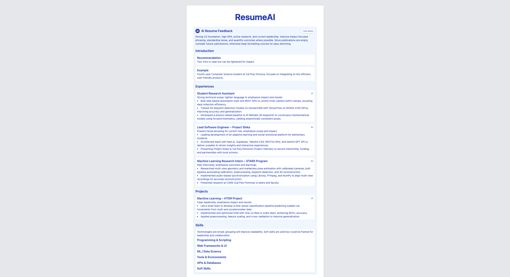

# ResumeAI

ResumeAI is an application that helps users quickly create and refine a professional resume. Users enter their personal information, relevant links, education, experience, publications, projects, and/or skills and see their qualifications in a professional resume layout. The application also enables users to quickly resize their resume content and receive AI-powered recommendations for efficient refinement. 

---

## Quick Start (Mac)

1. Download or clone this repository:

   ```bash
   git clone https://github.com/your-username/ResumeAI.git
   cd ResumeAI

2. Start the frontend
   ```bash
   cd frontend
   npm install
   npm run dev
   
3. Start the backend:
   ```
   cd backend
   pip install -r requirements.txt
   python app.py

## Tech Stack

| Layer        | Technologies                                             |
|-------------|----------------------------------------------------------|
| Frontend    | React, Vite, Tailwind CSS                                |
| Backend     | Python, Flask, WeasyPrint, python-dotenv                 |
| AI          | OpenAI API                                               |


## Screenshots

### 1. Resume Input Form

This is the main form where users enter their personal information, education, experience, projects, links, and skills.

[ResumeAI Demo (Google Drive)](https://drive.google.com/file/d/1quAot2ZlNzNNG1wARFUmbipsi164i240/view?usp=drive_link)

---

### 2. AI Recommendations Panel

After filling out the form, users can request AI-powered feedback on their resume content.



---

### 3. Generated PDF Resume

The app formats the data into a clean resume layout and generates a downloadable PDF.

[PDF Preview (PDF)](./screenshots/output.pdf)


